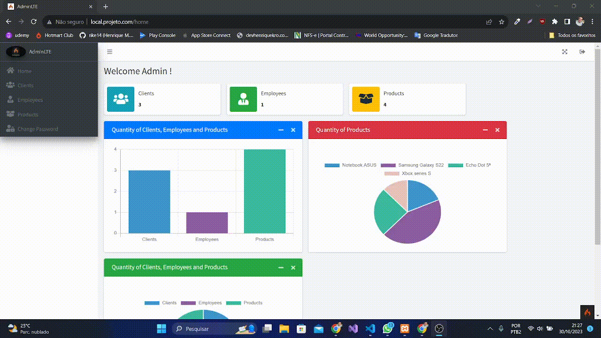
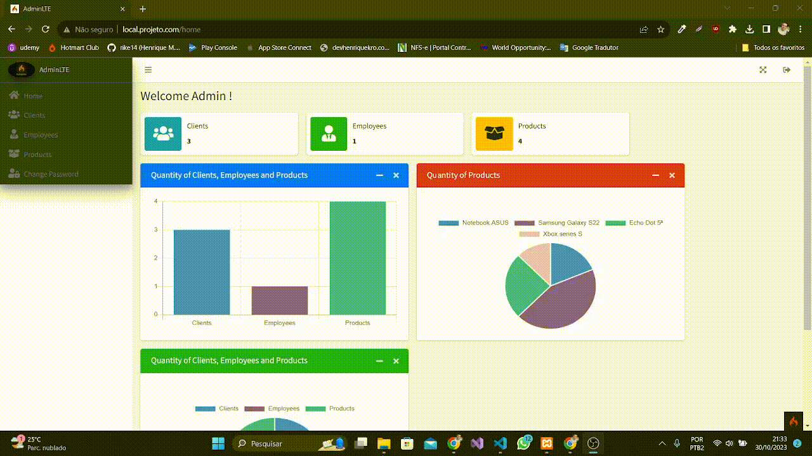

# [Codeigniter4](https://codeigniter.com/user_guide/index.html) 
# [AdminLTE 3](https://adminlte.io/themes/v3/index3.html)

  

## I Started progress PHP language, so i learning about framework CodeIgniter 4!    
----------------------------

- ### Login page :boom:

  

-----------------------------

- ### Home page :wink:

  

-----------------------------

- ### Client page CRUD - (Create/Read/Update/Delete) :boom:

  

-----------------------------

- ### Employees page CRUD - (Create/Read/Update/Delete) :boom:

  

-----------------------------

- ### Products page  CRUD - (Create/Read/Update/Delete) :boom:

  

-----------------------------

- ### Change password page :boom:

  

-----------------------------

Cya 😜
