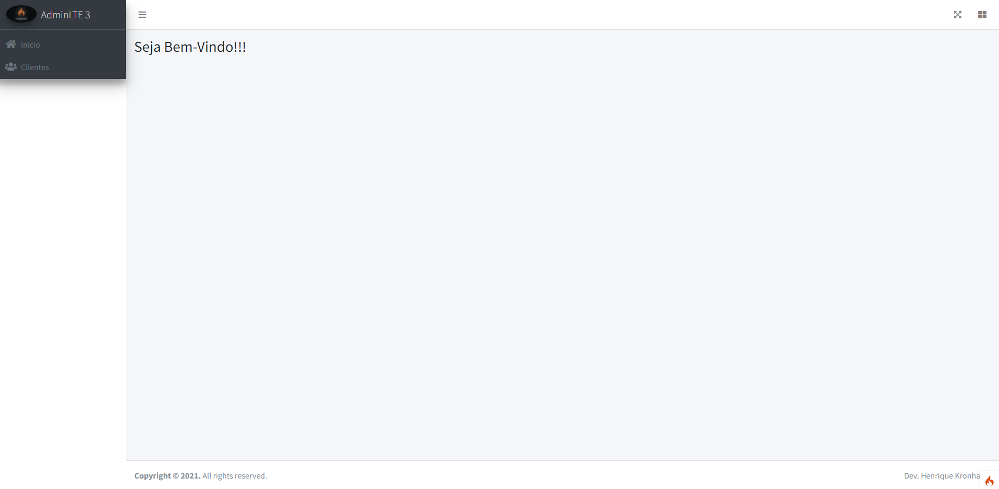
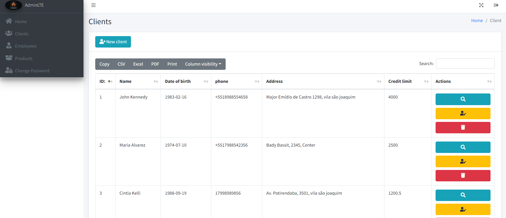
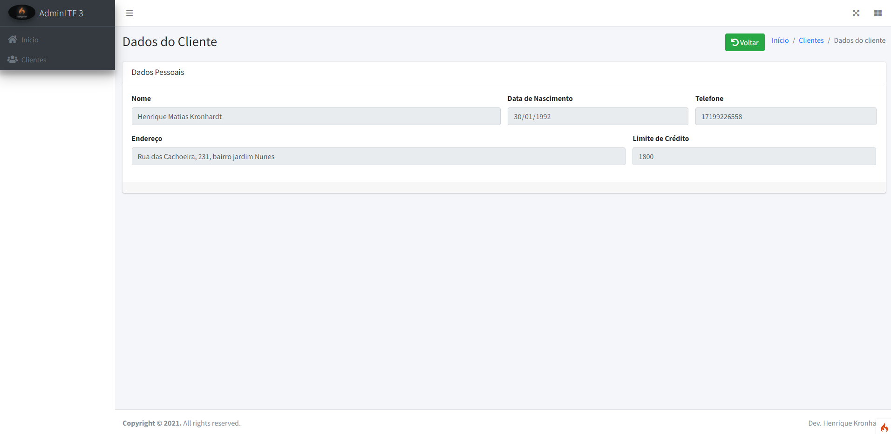
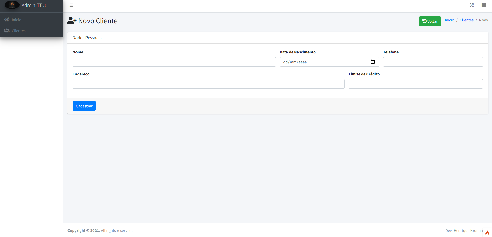
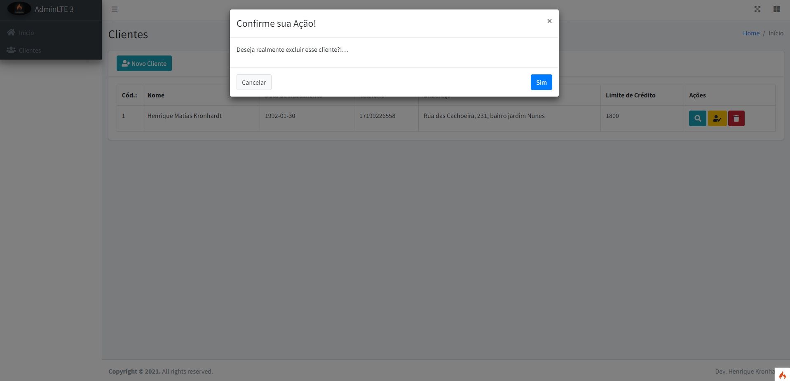

 # Codeigniter4

  

## I Started progress PHP language, so i learning about framework CodeIgniter 4!    
----------------------------

- ### Home page :wink:

  

-----------------------------

- ### Client page :boom:

  

-----------------------------

- ### View clients saved on sql page :boom:

  

-----------------------------

- ### Edit client page :boom:

  

-----------------------------

- ### Insert new client page :boom:

  

-----------------------------

- ### Delete client page :boom:

  

-----------------------------

Cya 😜
